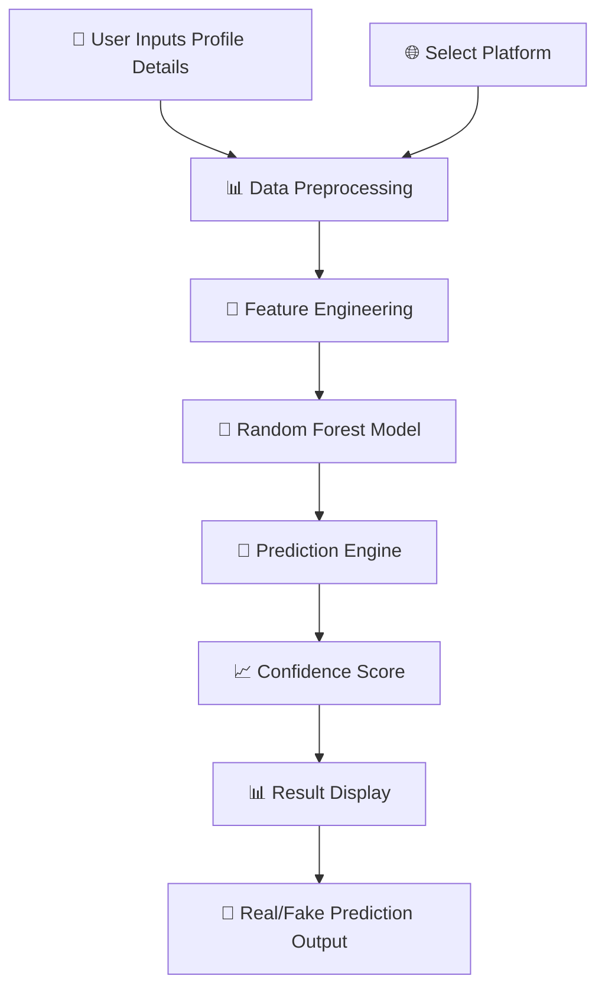

<!-- ============================================ -->
<!--         Fake Profile Detection Banner        -->
<!-- ============================================ -->

<div align="center">

# 🛡️ Fake Profile Detection

# Machine Learning Based Social Media Profile Authenticity System

## Detect Fakes. Verify Real. Stay Safe. 🔍

</div>

---

<p align="center">


</p>

---

# 📖 Project Description

**Fake Profile Detection System** is a machine-learning based web application designed to identify whether a social media account is real or fake using profile attributes instead of manual verification. It analyzes important factors such as follower counts, posts, bio availability, links, and profile picture presence to detect suspicious user behavior patterns.

This tool helps users, researchers, educators, and cybersecurity teams automatically analyze profiles and reduce the risk of scams, spam, impersonation, and fake engagement.

---

# ✨ Key Highlights

- 🛡️ ML-Powered Fake Profile Detection
- 🔍 Multi-Platform Support (Instagram, Twitter, Threads)
- 📊 Confidence Score for Predictions
- 🎨 Clean & Interactive UI
- 🧠 Random Forest Classification Model
- 📈 Feature-Based Profile Analysis
- 🔒 CSRF-Protected Forms
- 📊 Real-Time Prediction Results
- 💾 Model-Driven Detection
- 🔄 Easy Retraining Capability

---

# 🏗 System Architecture

The Fake Profile Detection System follows a modular ML pipeline that transforms raw profile attributes into authenticity predictions using a trained Random Forest classifier deployed through Django.



---

### 🔄 Application Workflow

1. User selects social media platform (Instagram/Twitter/Threads).
2. User enters profile details (posts, followers, following, etc.).
3. System processes and converts data to numeric format.
4. Trained Random Forest model analyzes profile attributes.
5. Model predicts profile authenticity (Real/Fake).
6. System displays prediction with confidence score.
7. User receives summary of inputs and results.

---

# 📊 Feature Comparison

| Feature | Manual Verification | Fake Profile Detection |
|:---|:---:|:---:|
| Speed | Slow | ✅ Instant |
| Multi-Feature Analysis | ❌ | ✅ 8+ Features |
| Platform Support | Limited | ✅ Multiple Platforms |
| Confidence Score | ❌ | ✅ Percentage |
| Automation | ❌ | ✅ AI-Powered |
| Scalability | ❌ | ✅ Batch Processing |
| Accuracy | Subjective | ✅ ML-Based |
| User-Friendly | ❌ | ✅ Web Interface |

---

# ✨ Core Features

## 🎯 Multi-Platform Detection
- Instagram Profile Analysis
- Twitter/X Account Verification
- Threads Profile Authentication
- Cross-Platform Support

---

## 🔍 Key Profile Attributes Analyzed

| Feature | Description |
|:---|:---|
| 📱 Number of Posts | Total posts count |
| 👥 Followers | Number of followers |
| 👤 Following | Number of following |
| 📝 Bio Available | Presence of biography |
| 🖼️ Profile Picture | Profile image presence |
| 🔒 Private Account | Account privacy status |
| 🔗 Link Available | Presence of external link |
| 🏷️ Profile Type | Business/Personal/Creator |

---

## 🧠 Random Forest Classification
- Ensemble learning approach
- Handles non-linear relationships
- Works with mixed feature types
- Provides feature importance scores
- Robust against overfitting

---

## 📊 Confidence Scoring
- Prediction confidence percentage
- Real/Fake probability distribution
- Interpretable results
- Decision transparency

---

## 🎨 Interactive UI
- Clean and responsive design
- Platform selection dropdown
- Form-based input system
- Real-time prediction display
- Input summary visualization

---

# 🛠 Technology Stack

| Layer | Technology |
|:---|:---|
| Programming Language | Python 3.11 |
| Web Framework | Django 4.2 |
| Machine Learning | Scikit-Learn (Random Forest) |
| Data Processing | Pandas + NumPy |
| Model Loading | Joblib |
| Database | SQLite |
| Frontend | HTML + CSS + Bootstrap |
| Deployment | Local / Cloud Ready |
| Version Control | Git & GitHub |

---

# 📂 Project Structure

```text
FAKE-PROFILE-DETECTION-ON-SOCIAL-MEDIA/
│
├── manage.py                            # Django Management Script
├── db.sqlite3                           # SQLite Database
├── requirements.txt                     # Dependencies
├── .gitignore                           # Git Ignore
├── README.md                            # Documentation
│
├── detector/                            # Main Django App
│   ├── __init__.py
│   ├── admin.py
│   ├── apps.py
│   ├── models.py
│   ├── tests.py
│   ├── views.py                         # Core Logic & ML Integration
│   ├── urls.py                          # App URL Configuration
│   │
│   ├── migrations/
│   │   ├── __init__.py
│   │   └── 0001_initial.py
│   │
│   └── templates/                       # HTML Templates
│       ├── home.html                    # Landing Page
│       ├── input_details.html           # Profile Input Form
│       └── result.html                  # Prediction Results
│
├── vfp_d/                               # Django Project Config
│   ├── __init__.py
│   ├── asgi.py
│   ├── settings.py                      # Project Settings
│   ├── urls.py                          # Project URL Configuration
│   └── wsgi.py
│
├── static/                              # Static Files
│   └── images/
│       ├── 1.png
│       ├── 2.png
│       └── 3.png
│
├── Project Diagrams/                    # System Diagrams
│   ├── [Architecture Diagram]
│   ├── [Flowchart]
│   └── [UML Diagram]
│
├── venv/                                # Virtual Environment
│
├── fake_account_model.pkl               # Trained ML Model
├── FPD2.csv                             # Dataset for Training
├── FPD2.xls                             # Dataset (Excel)
├── code.txt                             # Code Snippets
├── detector.zip                         # App Archive
└── f_p_d.zip                            # Project Archive
```

---

# 📸 Application Preview


The screenshots above demonstrate the Fake Profile Detection System's complete workflow—from profile input and feature selection to ML-based prediction, confidence scoring, and result visualization.


---

# ⚙ Installation

## Prerequisites

- Python 3.11+
- pip

---

### Clone Repository

```bash
git clone https://github.com/Keya3639/FAKE-PROFILE-DETECTION-ON-SOCIAL-MEDIA.git

cd FAKE-PROFILE-DETECTION-ON-SOCIAL-MEDIA
```

---

### Create Virtual Environment

```bash
python -m venv venv

# Windows
venv\Scripts\activate

# macOS/Linux
source venv/bin/activate
```

---

### Install Dependencies

```bash
pip install -r requirements.txt
```

---

### Apply Migrations

```bash
python manage.py makemigrations
python manage.py migrate
```

---

### Run Application

```bash
python manage.py runserver
```

---

### Access Application

Open browser and navigate to: `http://127.0.0.1:8000`

---

# 🚀 Demo Workflow

| Step | Action |
|:--:|:---|
| 1 | Select Social Media Platform |
| 2 | Enter Profile Details (Posts, Followers, etc.) |
| 3 | Click "Detect Profile" |
| 4 | System Preprocesses Input Data |
| 5 | Random Forest Model Makes Prediction |
| 6 | View Prediction Result |
| 7 | Check Confidence Score |
| 8 | Review Input Summary |

---

# 🌟 Why Fake Profile Detection?

Unlike manual verification methods that rely on subjective judgment and limited feature analysis, **Fake Profile Detection System** leverages **Machine Learning** to analyze multiple profile attributes simultaneously and identify suspicious patterns with high accuracy.

This system helps:

- 🛡️ Identify bots and fake engagement
- 🔍 Detect scam and impersonation profiles
- 📊 Validate influencer authenticity
- 🎓 Demonstrate ML + Django integration
- 🏢 Support content moderation efforts

**Fake Profile Detection doesn't just check profiles—it understands hidden patterns.**

---

# 📈 Advantages

- ⚡ Reduces time spent manually checking accounts
- 🔍 Detects suspicious accounts early
- 📊 Handles multiple features simultaneously
- 🧩 Works even when some details are missing
- 📈 Highly interpretable with logs & confidence level
- 🚀 Easy to deploy and integrate into portals
- 🎯 ML-based accuracy over rule-based systems

---

# ⚠️ Limitations

- Model accuracy depends on training dataset quality
- Cannot detect deep-fake identity verification
- Limited to provided features — full profile scraping not included
- Results are probabilistic (not guaranteed confirmation)
- Needs retraining for new platforms and behavior patterns

---

# 🌟 Real-Time Applications

- 🔍 **Social Media Research:** Identify bots and fake engagement
- 🛡️ **Cybersecurity:** Detect scam and impersonation profiles
- 🎓 **Student Projects:** Demonstrates ML + Django integration
- 📊 **Content Moderation:** Filter out spam accounts
- 💼 **Business Marketing:** Validate influencer authenticity

---

# 🔮 Future Enhancements

| Phase | Features |
|:---|:---|
| Phase 1 | Live scraping from platforms using APIs |
| Phase 2 | Advanced deep-learning model for improved accuracy |
| Phase 3 | Visualization dashboards |
| Phase 4 | Role-based login system (admin/user) |
| Phase 5 | Real-time prediction history storage |
| Phase 6 | Graph-based fraud analysis |
| Phase 7 | Cloud deployment (Render/AWS/Railway) |
| Phase 8 | Multi-platform API integration |

---

# 🛣 Roadmap

- ✅ ML-Based Fake Profile Detection
- ✅ Django Web Application Integration
- ✅ Multi-Platform Support
- ✅ Confidence Score Generation
- ✅ Interactive User Interface
- 🔄 Live API Integration
- 🔄 Advanced Deep Learning Models
- 🔄 Cloud Deployment

---

# 🎯 Conclusion

The **Fake Profile Detection System** demonstrates how **Machine Learning** and **Django** can work together to solve real-world online safety problems.

By analyzing profile patterns instead of relying on manual checks, this project provides a smart approach toward identifying suspicious accounts and improving digital security.

With further improvement and larger datasets, it can evolve into a powerful verification tool for social media platforms and research communities.

---

# 👩‍💻 Developer

## Keya Das

**MCA (Artificial Intelligence & Data Science)**

🌐 **GitHub**

https://github.com/Keya3639

📧 **Email**

keyakarunamoydas@gmail.com

---

# 🙏 Acknowledgements

This project was developed using the following open-source technologies and frameworks:

- 🧠 Scikit-Learn
- 🎨 Django
- 🐍 Python
- 🐼 Pandas
- 📊 NumPy
- 💾 Joblib
- 🗄️ SQLite
- 🌍 Open Source Community

---

<div align="center">

# 🛡️ Fake Profile Detection

### Detect Fakes. Verify Real. Stay Safe. 🔍

<br>

**Built with ❤️ using**

**Python • Django • Scikit-Learn • Pandas • NumPy • Joblib • SQLite**

<br>

</div>
```
